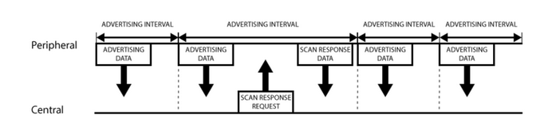
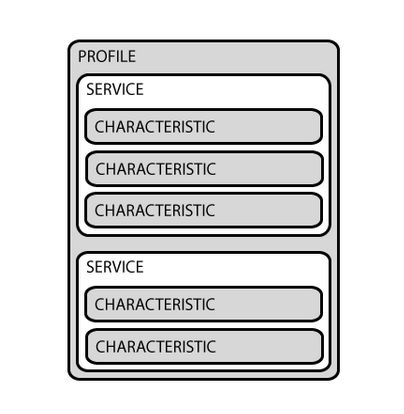

# Bluetooth Low Energy

## GAP

GAP stands for *Generic Access Profile*.  Normally the GAP protocol is used to establish a connection between two devices so that GATT Services can be used. 

GAP controls connections and advertisements, and makes your device visible to the outside world. 

The two main BLE device roles are:
- **Peripheral**
- **Central** 

There are two ways to send advertising out with GAP
- **Advertising Data:** Manditory, constantly transmitted by peripheral devices, and listened for by central devices
- **Scan Response:** Optional, secondary payload that the central can request from a peripheral.  

### Advertising

A peripheral is programmed to transmit a 31 byte advertising payload over a predetermined *advertising interval.* There is no strict rule on the size of the advertising interval, it just depends on what makes sense for a given peripheral in terms of responsiveness vs power draw. 

If the central device is interested it can send a scan response request. If the peripheral is set up to accept it then it will respond with another 31 byte scan response payload. 

Normally once a connection is established between the peripheral and central device, the peripheral ceases to transmit advertisement data and the devices switch to using GATT services to communicate privately. 

## GATT

GATT stands for *Generic ATTribute* 

It defines how two devices send data back and fourth using *services* and *characteristics*

*GATT connections are exclusive:* a ble peripheral can only be connected to a single ble central device at a time. A central device can be connected to many peripherals. 

### GATT Transactions

The Peripheral is know as the **GATT Server** and the central is known as the **GATT Client**. 

All transactions start by a request sent out by the GATT Client, which receives a response from the GATT server. 

### Profiles, Services, and Characteristics 

___

### References
https://learn.adafruit.com/introduction-to-bluetooth-low-energy/gap